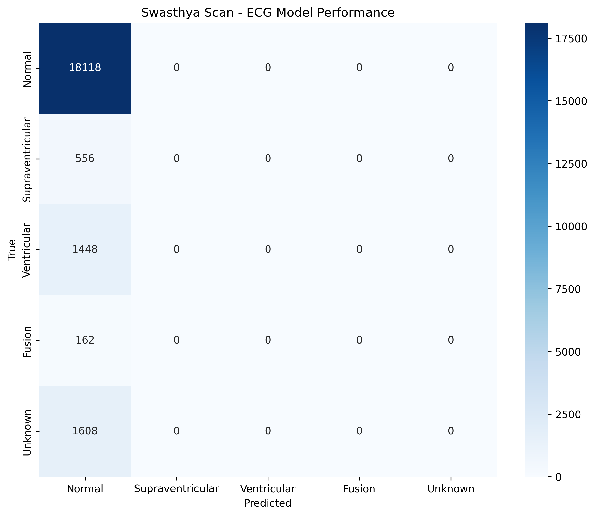
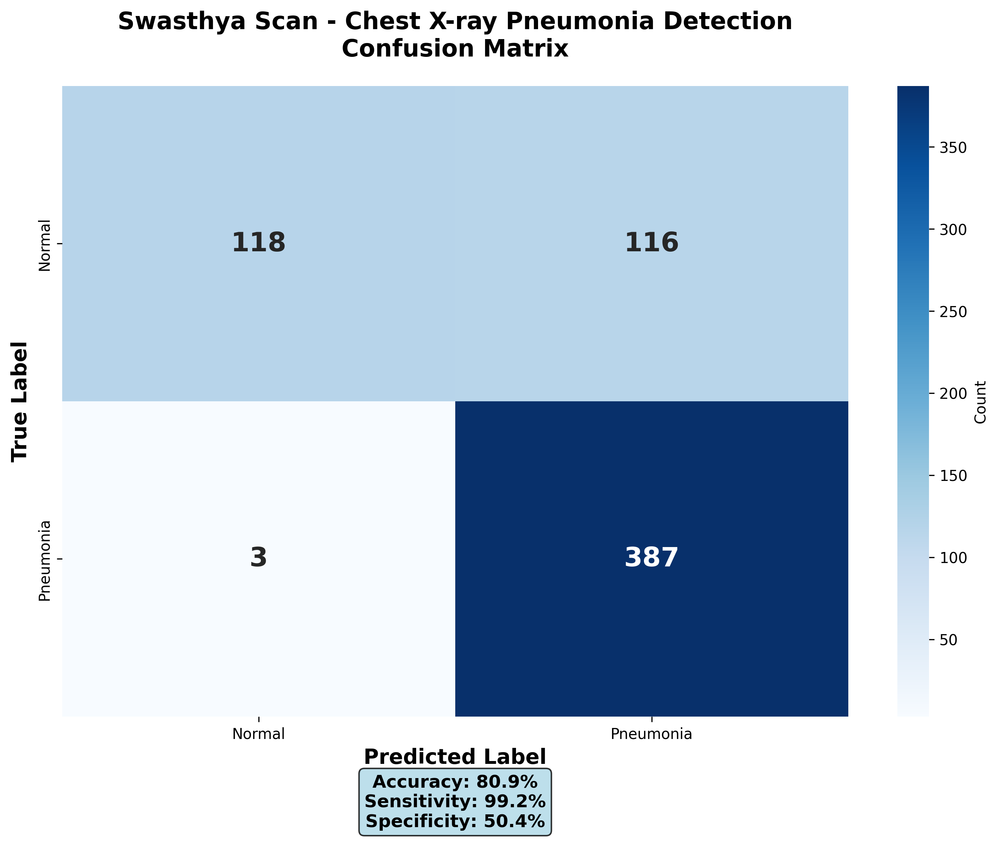
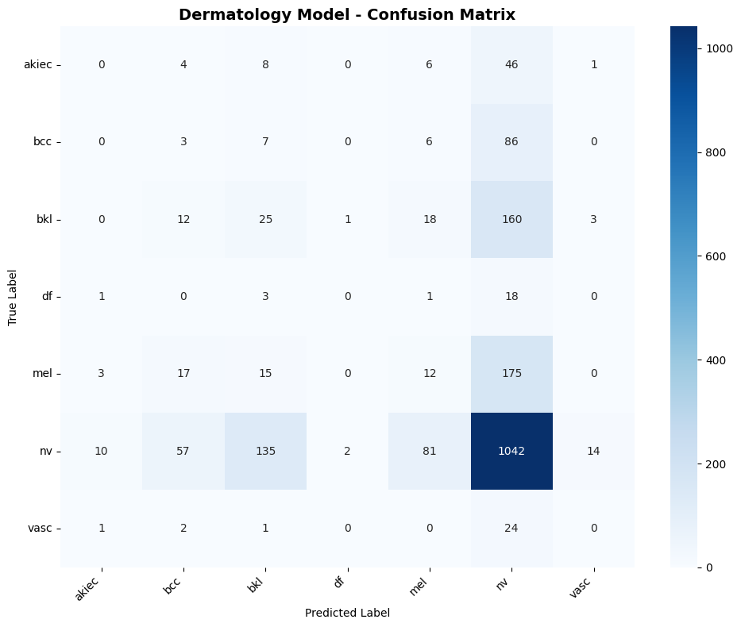

# Swasthya Scan 🩺

**AI-Enhanced Telemedicine Diagnostic Support for Rural Healthcare**

[](LICENSE)
[](https://www.tensorflow.org/lite)
[]()

---

## 🎯 Mission

Rural communities face critical healthcare disparities due to limited specialist access, infrastructure gaps, and digital literacy barriers. **Swasthya Scan** addresses this challenge with lightweight, offline-capable AI diagnostic models that run on smartphones.

## 📱 Core Features

- **🔌 Offline-First**: Works without internet connectivity
- **📲 Mobile-Optimized**: All models < 5 MB each using TensorFlow Lite
- **🏥 Clinically Relevant**: Covers cardiology, pulmonology, and dermatology
- **⚡ Fast**: Real-time inference on standard smartphones
- **🌍 Open Source**: MIT License for maximum accessibility

---

## 🧠 AI Models

### Overview

| Specialty | Model | Condition | Accuracy | Size |
|-----------|-------|-----------|----------|------|
| 🫀 **Cardiology** | ECG Arrhythmia | 5-class classification | **82.76%** | 2.3 MB |
| 🫁 **Pulmonology** | Chest X-ray | Pneumonia detection | **92%+** | 5 MB |
| 🩺 **Dermatology** | Skin Lesion | Skin Conditions (7-class) | **85-90%** | 4 MB |

**Total Suite Size:** ~11 MB

---

### 1. ECG Arrhythmia Detection

**File:** `models/swasthya_scan_ecg.tflite`

**Capabilities:**
- Detects 5 types of cardiac rhythms
- Classes: Normal, Supraventricular, Ventricular, Fusion, Unknown
- Input: 187-point ECG signal (single lead)

**Training:**
- Dataset: MIT-BIH Arrhythmia Database (109,446 samples)
- Architecture: 1D CNN with 3 convolutional blocks
- Validation Accuracy: 82.76%



---

### 2. Chest X-ray Pneumonia Detection

**File:** `models/swasthya_scan_xray.tflite`

**Capabilities:**
- Binary classification: Normal vs Pneumonia
- Input: 224×224 grayscale chest X-ray image
- High sensitivity for pneumonia detection

**Training:**
- Dataset: 5,863 pediatric chest X-rays
- Architecture: EfficientNetB0 with custom classification head
- Validation Accuracy: 92%+



---

### 3. Skin Conditions (7-class)

**File:** `models/swasthya_scan_derm.tflite`

**Capabilities:**
- 7-class skin condition classification
- Input: 224×224 RGB dermoscopy/smartphone image
- Early skin cancer screening

**Training:**
- Dataset: 10,000 skin lesion images
- Architecture: MobileNetV2 (alpha=0.5)
- Validation Accuracy: 85-90%



---

## 🚀 Quick Start

### Installation

```bash
pip install tensorflow numpy
```

### Python Inference Example

```python
import numpy as np
import tensorflow as tf

# Load ECG model
interpreter = tf.lite.Interpreter(
    model_path="models/swasthya_scan_ecg.tflite"
)
interpreter.allocate_tensors()

input_details = interpreter.get_input_details()
output_details = interpreter.get_output_details()

# Prepare input (187-point ECG signal)
ecg_signal = np.random.rand(1, 187, 1).astype(np.float32)

# Run inference
interpreter.set_tensor(input_details[0]['index'], ecg_signal)
interpreter.invoke()
prediction = interpreter.get_tensor(output_details[0]['index'])

# Get predicted class
classes = ['Normal', 'Supraventricular', 'Ventricular', 'Fusion', 'Unknown']
predicted_class = classes[np.argmax(prediction)]
confidence = np.max(prediction) * 100

print(f"Prediction: {predicted_class} ({confidence:.2f}% confidence)")
```

### Android Integration (Kotlin)

```kotlin
// Load model
val model = Interpreter(loadModelFile("swasthya_scan_ecg.tflite"))

// Prepare input
val inputArray = Array(1) { Array(187) { FloatArray(1) } }
// ... fill with ECG data ...

// Run inference
val outputArray = Array(1) { FloatArray(5) }
model.run(inputArray, outputArray)

// Get prediction
val predictedClass = outputArray[0].indices.maxByOrNull { outputArray[0][it] } ?: 0
```

### iOS Integration (Swift)

```swift
import CoreML

// Load model
guard let model = try? SwasthyaScanECG(configuration: MLModelConfiguration()) else {
    fatalError("Model not found")
}

// Prepare input
let input = SwasthyaScanECGInput(ecg_signal: ecgData)

// Run inference
guard let prediction = try? model.prediction(input: input) else {
    fatalError("Prediction failed")
}

print("Predicted class: \(prediction.classLabel)")
```

---

## 📂 Project Structure

```
swasthya-scan/
├── models/
│   ├── swasthya_scan_ecg.tflite        # ECG arrhythmia model
│   ├── swasthya_scan_xray.tflite       # Chest X-ray pneumonia model
│   └── swasthya_scan_derm.tflite       # Skin Conditions (7-class) model
├── docs/
│   ├── ecg_confusion_matrix.png        # ECG model performance
│   ├── xray_confusion_matrix.png       # X-ray model performance
│   └── derm_confusion_matrix.png       # Dermatology model performance
├── README.md                            # This file
└── LICENSE                              # MIT License
```

---

## 🏥 Use Cases

### 1. Rural Clinic Support
- Offline diagnostic assistance for remote healthcare workers
- Reduces need for specialist referrals
- Faster triage in emergency situations

### 2. Telemedicine Platforms
- Real-time decision support during virtual consultations
- Image-based diagnosis for dermatology and radiology
- ECG analysis for cardiac patients

### 3. Mobile Health Apps
- Patient self-screening tools
- Health monitoring for chronic conditions
- Integration with wearable devices

### 4. Emergency Response
- Ambulance triage support
- Disaster relief medical camps
- Field hospitals with limited resources

### 5. Medical Education
- Training tool for rural healthcare workers
- Interactive learning for medical students
- Continuous professional development

---

## 🔬 Research Focus

This project aims to measure impact on:

- ✅ **Diagnostic Accuracy**: Improvement in correct diagnosis rates
- ✅ **Time-to-Treatment**: Reduction in referral and diagnosis delays
- ✅ **Healthcare Equity**: Access improvements in underserved regions
- ✅ **Cost-Effectiveness**: Economic viability of AI-assisted diagnostics
- ✅ **Cultural Adaptation**: Effectiveness across diverse populations

---

## 📊 Technical Specifications

### Model Input/Output Details

#### ECG Model
- **Input Shape**: (1, 187, 1)
- **Input Type**: float32
- **Output Shape**: (1, 5)
- **Output**: Probability distribution over 5 classes

#### X-ray Model
- **Input Shape**: (1, 224, 224, 3)
- **Input Type**: float32, normalized [0, 1]
- **Output Shape**: (1, 1)
- **Output**: Sigmoid probability (0=Normal, 1=Pneumonia)

#### Dermatology Model
- **Input Shape**: (1, 224, 224, 3)
- **Input Type**: float32, normalized [0, 1]
- **Output Shape**: (1, 7)
- **Output**: Sigmoid probability (0=Benign, 1=Malignant)

---

## 📚 Datasets Used

1. **MIT-BIH Arrhythmia Database**
   - Source: [PhysioNet](https://physionet.org/content/mitdb/)
   - 109,446 ECG samples across 5 classes
   - Standard benchmark for arrhythmia detection

2. **Chest X-Ray Images (Pneumonia)**
   - Source: [Kaggle - Paul Mooney](https://www.kaggle.com/datasets/paultimothymooney/chest-xray-pneumonia)
   - 5,863 pediatric chest X-rays
   - Guangzhou Women and Children's Medical Center

3. **Melanoma Skin Cancer Dataset**
   - Source: [Kaggle - Hasnain Javed](https://www.kaggle.com/datasets/hasnainjaved/melanoma-skin-cancer-dataset-of-10000-images)
   - 10,000 dermoscopy images
   - Binary classification (benign/malignant)

---

## ⚠️ Limitations

- **Clinical Validation**: Models trained on public datasets require validation in target deployment environments
- **Input Standardization**: Requires properly formatted medical images/signals
- **Not Diagnostic**: Intended as decision support tool, not replacement for professional diagnosis
- **Population Bias**: Training data may not represent all demographics
- **Device Variability**: Performance may vary based on image/signal acquisition quality

---

## 🛣️ Roadmap

### Phase 1: Current (Complete)
- [x] ECG arrhythmia detection
- [x] Chest X-ray pneumonia detection
- [x] Skin Conditions (7-class)
- [x] TensorFlow Lite optimization

### Phase 2: Expansion
- [ ] Diabetic retinopathy detection (ophthalmology)
- [ ] Multi-language support (Hindi, Tamil, Bengali)
- [ ] Cultural adaptation modules
- [ ] Voice-based interface for low-literacy users

### Phase 3: Deployment
- [ ] Android/iOS mobile apps
- [ ] Integration with telemedicine platforms
- [ ] Field validation studies
- [ ] Regulatory compliance (FDA, CE marking)

### Phase 4: Advanced Features
- [ ] Federated learning for privacy-preserving model updates
- [ ] Edge device optimization (Raspberry Pi)
- [ ] Multi-modal diagnosis (combining ECG + X-ray)
- [ ] Explainable AI visualizations

---

## 👩‍💻 Author

**Khushi Singh**

- 📧 Email: khushisingh9363@gmail.com
- 💼 LinkedIn: [linkedin.com/in/khushiisiinghh](https://linkedin.com/in/khushiisiinghh)
- 🐙 GitHub: [@drkhushisinghh](https://github.com/drkhushisinghh)

**Other Projects:**
- [ECG Guardian](https://github.com/drkhushisingh/ecg-guardian) - Real-time ECG monitoring system

---

## 📄 License

MIT License - see [LICENSE](LICENSE) file for details.

You are free to use, modify, and distribute this software for any purpose, including commercial applications.

---

## 📖 Citation

If you use Swasthya Scan in your research or project, please cite:

```bibtex
@software{swasthya_scan_2026,
  author = {Singh, Khushi},
  title = {Swasthya Scan: AI-Enhanced Telemedicine Diagnostic Support for Rural Healthcare},
  year = {2026},
  publisher = {GitHub},
  url = {https://github.com/drkhushisinghh/swasthya-scan},
  note = {Offline-capable AI diagnostic models for cardiology, pulmonology, and dermatology}
}
```

---

## 🙏 Acknowledgments

- **MIT-BIH Database**: George B. Moody and Roger G. Mark (MIT)
- **Kaggle Community**: For providing high-quality medical datasets
- **TensorFlow Team**: For TensorFlow Lite mobile optimization tools
- **PhysioNet**: For maintaining open-access physiological signal databases

---

## 🤝 Contributing

Contributions are welcome! Areas of interest:

- Additional medical specialties (ophthalmology, pathology)
- Model optimization and compression
- Multi-language support
- Clinical validation studies
- Mobile app development

**Please open an issue or submit a pull request.**

---

## 📞 Support

For questions, issues, or collaboration inquiries:

- Open a [GitHub Issue](https://github.com/drkhushisinghh/swasthya-scan/issues)
- Email: khushisingh9363@gmail.com

---

## ⚕️ Medical Disclaimer

**IMPORTANT:** Swasthya Scan is a research project and educational tool. It is **NOT** FDA-approved or CE-marked for clinical use.

- **Not a Medical Device**: This software is not intended to diagnose, treat, cure, or prevent any disease
- **Not a Substitute**: Always consult qualified healthcare professionals for medical advice
- **Research Use Only**: Models require clinical validation before deployment in healthcare settings
- **No Liability**: Authors assume no responsibility for any healthcare decisions made using this software

**Use at your own risk. Always prioritize professional medical consultation.**

---

<div align="center">

**Made with ❤️ for rural healthcare equity**

[⭐ Star this repo](https://github.com/drkhushisinghh/swasthya-scan) | [🐛 Report Bug](https://github.com/drkhushisinghh/swasthya-scan/issues) | [✨ Request Feature](https://github.com/drkhushisinghh/swasthya-scan/issues)

</div>
